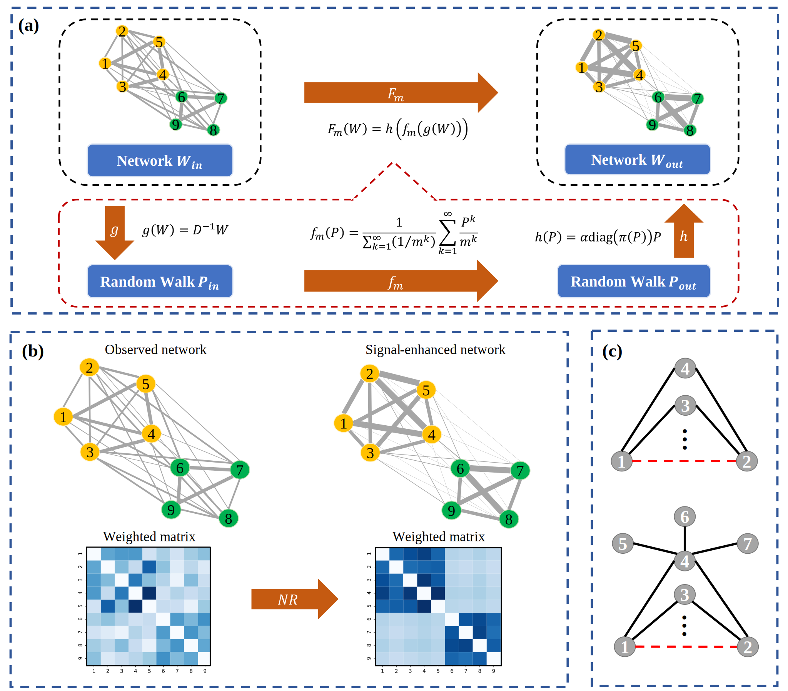

# Network-Refinement
Network Refinement: Denoising complex networks for better community detection.

For more details, please check out our [publication](https://doi.org/10.1016/j.physa.2023.128681).

